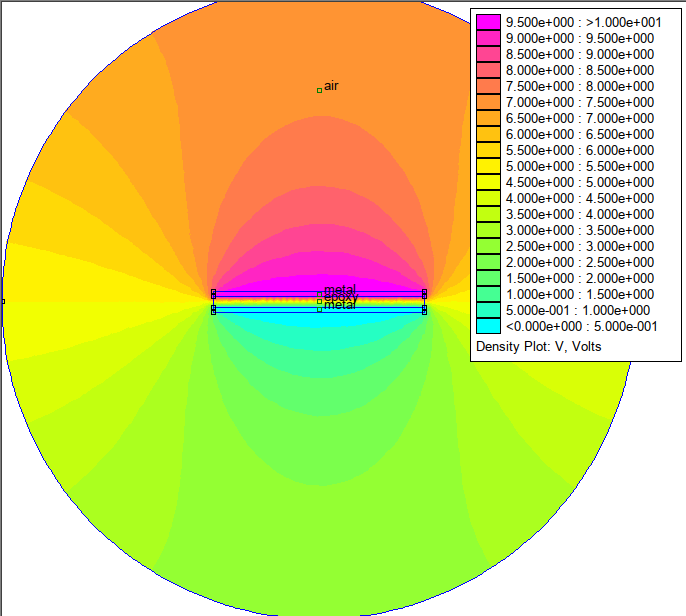

## Simulation of an electrostatic capacitor

This example shows a solution of a simple electrostatic task, a capacitance calculation of a planar capacitor.
The geometry will be defined by using the Python-based parametric interface of femm-from-py, while the following
commands shows the usage and the possibilities of a simple Python-based interface on the given problem.

### FEMM Problem and Parametric geometry definition

The modelled geometry is defined by the following image. .

Whre the *&epsilon;* represents the permittivity of the used dielectric, *d* is the theickness of the layer, while *A*
is the surface. The capacitance will be modelled by a python function, which has thress parameters:

* *d*, the thickness of the insulating layer
* *width* the width of the capacitance's armature
* *thickness* of the capacitance's armature

The first step for the modelling is to initialize the problem, define the applied fields, metrical units for the solver.
This task can be done by the following commands:

```
    from src.femm_problem import FemmProblem
    from src.general import LengthUnit

    planar_problem = FemmProblem(out_file="planar_data.csv")
    planar_problem.electrostatic_problem(LengthUnit.METERS, "planar")
```

The results will be saved to planar_data.csv.

At first, we have to initialize a geometry object, to store and generate the goemetry for FEMM:

```
geo = Geometry()
```

The geometry will be defined by **Node(x,y)** and **Line(Start_Node, End_Node)** objects only.
The two armature of the capacitance will be defined by the following nodes:

```
n1 = Node(-width / 2, d / 2)
n2 = Node(-width / 2, d / 2 + thickness)
n3 = Node(width / 2, d / 2 + thickness)
n4 = Node(width / 2, d / 2)

n5 = Node(-width / 2, -d / 2)
n6 = Node(-width / 2, -d / 2 - thickness)
n7 = Node(width / 2, -d / 2 - thickness)
n8 = Node(width / 2, -d / 2)
```

Connecting the nodes with lines, will define the geometry of the aramtures and the insulation:

```
l1 = Line(n1, n2)
l2 = Line(n2, n3)
l3 = Line(n3, n4)
l4 = Line(n4, n1)

l5 = Line(n5, n6)
l6 = Line(n6, n7)
l7 = Line(n7, n8)
l8 = Line(n8, n5)

l9 = Line(n1, n5)
l10 = Line(n8, n4)
```

The following circle object defined by 4 arcs to create an outline around the goemetry and define a boundary.
The *CircleArc* object can be defined by a start-node, center-node, end-node-triplets.

```
center = Node(0, 0)
out1 = Node(0.0, 0.3)
out2 = Node(-0.3, 0.0)
out3 = Node(0.0, -0.3)
out4 = Node(0.3, 0.0)

arc1 = CircleArc(out1, center, out2)
arc2 = CircleArc(out2, center, out3)
arc3 = CircleArc(out3, center, out4)
arc4 = CircleArc(out4, center, out1)
```

The previously defined objects should be added to the *Node*, *Line* and *CircleArc* list for the following geometrical
objects and then the geometry will be generated by the following command.

```
geo.nodes = [n1, n2, n3, n4, n5, n6, n7, n8, out1, out2, out3, out4]
geo.lines = [l1, l2, l3, l4, l5, l6, l7, l8, l9, l10]
geo.circle_arcs = [arc1, arc2, arc3, arc4]

planar_problem.create_geometry(geo)
```

### Material properties

The following code snippet will be defined the used materials: the epoxy insulation, the air and the metal.
The **ElectrostaticMaterial** class should be imported from the electrostatics modul, the name of the applied materials
shuold be defined together with the permittivity of the materials to the x and the y direction.

```
from src.electrostatics import ElectrostaticMaterial

epoxy = ElectrostaticMaterial(material_name="epoxy", ex=3.7, ey=3.7, qv=0.0)
air = ElectrostaticMaterial(material_name="air", ex=1.0, ey=1.0, qv=0.0)
metal = ElectrostaticMaterial(material_name="metal", ex=1.0, ey=1.0, qv=0.0)
```

The defined materials should be added to the problem, which defined before the goemetry can be made by the following
commands:

```
planar_problem.add_material(epoxy)
planar_problem.add_material(air)
planar_problem.add_material(metal)
```

The following commands a bit differs from the original, lua-based command interpreter of the FEMM code. Using the
original interpreter, we have to select a material block, set the block properties, clear the selection by a different
command. These three distinct steps merged together into on command. We have to define only a block label (as a Node)
and attach it to a the problem:

```
insulation_block = Node(0.0, 0.0)

planar_problem.define_block_label(insulation_block, epoxy)
planar_problem.define_block_label(Node(0.0, 0.2), air)

planar_problem.define_block_label(Node(0.0, d / 2 + thickness / 2), metal)
planar_problem.define_block_label(Node(0.0, - d / 2 - thickness / 2), metal)
```

### Boundary conditions

Defining the boundaries also a simplified process, what is very similar to the material definitions. Firstly, we have to
define and add the boundary conditions to the defined problem. To resolve this problem, we have to define a two
Dirichlet boundaries and one Neumann boundary condition, in the following way:

```
v0 = ElectrostaticFixedVoltage("U0", 10.0)
gnd = ElectrostaticFixedVoltage("GND", 0.0)
neumann = ElectrostaticSurfaceCharge('outline', 0.0)

planar_problem.add_boundary(neumann)
planar_problem.add_boundary(gnd)
planar_problem.add_boundary(v0)
```

The previously defined boundary conditions should be added to the geometrical conditions:

```
# voltage electrode
planar_problem.set_boundary_definition(l1.selection_point(), v0)
planar_problem.set_boundary_definition(l2.selection_point(), v0)
planar_problem.set_boundary_definition(l3.selection_point(), v0)
planar_problem.set_boundary_definition(l4.selection_point(), v0)

# gnd electrode
planar_problem.set_boundary_definition(l5.selection_point(), gnd)
planar_problem.set_boundary_definition(l6.selection_point(), gnd)
planar_problem.set_boundary_definition(l7.selection_point(), gnd)
planar_problem.set_boundary_definition(l8.selection_point(), gnd)

# outer surface of the geometry
planar_problem.set_boundary_definition(arc1.selection_point(), neumann)
planar_problem.set_boundary_definition(arc2.selection_point(), neumann)
planar_problem.set_boundary_definition(arc3.selection_point(), neumann)
planar_problem.set_boundary_definition(arc4.selection_point(), neumann)
```

The above-mentioned commands also contains a simplifcation, it can automatically select the given line or cricle arc
segment.

### Performing the analysis

The following commands tells the FEMM interpreter to create a mesh, solve the problem and calculate different
quantities.
Firstly, we are calculating volume integral values, then we can calculate the point values at the center of the
insulator of the capacitor.
The last command can write out the lua file, which will be processed by FEMM executor.

```
planar_problem.make_analysis('planar')
planar_problem.get_integral_values([insulation_block], save_image=True,
variable_name=ElectrostaticIntegralType.StoredEnergy)

planar_problem.get_integral_values([insulation_block], save_image=True,
                                       variable_name=ElectrostaticIntegralType.AvgE)

planar_problem.get_integral_values([insulation_block], save_image=True,
                                       variable_name=ElectrostaticIntegralType.AvgD)

planar_problem.get_point_values(center)
planar_problem.write("planar.lua")
```

### Running the code with the FEMM executor

The FEMM executor simply runs FEMM, then performs the calculation with the lua file and gives back the results.
It can be performed by the following commands:

```
femm = Executor()
current_dir = os.getcwd()
lua_file = current_dir + "/planar.lua"
femm.run(lua_file)
```

The resulting potential distribution is depicted in the following image:
.
