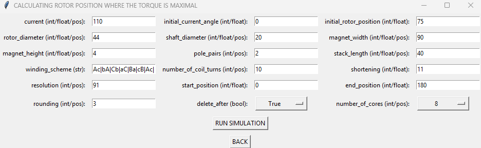
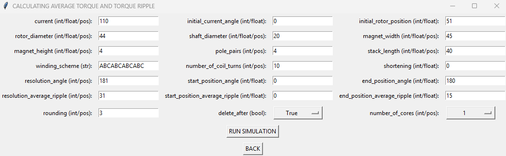

# Tests for the Electric Machine Torque Calculations

## Some tests that are also intended as examples

This documentation serves as a sum of examples calculated during the algorithm tests. Some tricks and tips regarding the
code, the physics behind it and the limitations are highlighted. The documentation is not intended to cover all the
physics behind the simulations. It assumes basic knowledge of electrical engineering and electric machines. For  
complete coverage, refer to the Design of **Rotating Electrical Machines, Juha Pyrhönen, Tapani Jokinen, Valéria Hrabovcová, 
DOI:10.1002/9781118701591** or for Hungarian-speaking fellows **Villamos Gépek** series from **József Liska**.

## Test cases:

* Distributed winding, 1 layer, 12 slots and 4 poles (2 pole pairs)
* Distributed winding, 2 layers, 1 shortening, 12 slots and 4 poles  (2 pole pairs)
* Concentrated winding, 12 slots and 8 poles  (4 pole pairs)

## Distributed winding, 1 layer, 12 slots and 4 poles  (2 pole pairs)

Winding scheme: **A|b|C|a|B|c|A|b|C|a|B|c|** (https://www.bavaria-direct.co.za/scheme/calculator/)

The example machine is shown below. This is the model created in FEMM (https://www.femm.info/wiki/HomePage).

The example FEMM file is: [example_test1.fem](example_test1.fem)

start up run_selector.py

### Selecting cogging torque calculation (COGGING).

Cogging torque is an unwanted torque ripple that occurs in electric machines due to the interaction between the
permanent magnets of the rotor and the stator teeth. Cogging torque results from variations in magnetic reluctance as 
the rotor moves relative to the stator. This effect is particularly noticeable in permanent magnet synchronous machines
(PMSMs), leading to vibration, noise, and reduced smoothness in motion.

* Rotate the rotor in small steps (one degree or less) over an electrical period. For each step, compute the
electromagnetic torque using FEM without any current.

An electrical period for this slot/magnet pole combination will have 12 cogging steps per turn due to the Least Common
Multiple _LCM(12,4)=**12**_. This means that 12 periods are present over one rotation, so over 360 mechanical degrees. 
To decrease the computational burden _360/12=**30**_ degrees is enough to calculate one period of the cogging torque.

After selecting the _cogging_ option, the parameter list jumps up, as shown above. First of all, every parameter is limited
to a given input type. Those parameters are constantly checked for valid input, and the program will not start until all
exceptions are solved. Please keep that in mind! The algorithm checks the input if you press _start simulation_.

        int/float:          int (integer) means discrete whole-number values and float (floating-point) means
                            continuous decimal values, allowing for higher precision

        int/float/pos:      int (integer) means discrete whole-number values and float (floating-point) means
                            continuous decimal values, allowing for higher precision but only positive numbers higher
                            than zero (>0)

        int/pos:            int (integer) means discrete whole-number values, but only positive numbers higher than
                            zero (>0)

        str:                str (string) is a sequence of characters used to represent text

1) **initial_rotor_position [mechanical degrees]:** Set the initial rotor position in mechanical degrees, which helps to
position the rotor where the torque of the first calculation is zero. It helps to find the starting point of a period.
The starting point depends on the number of poles, the winding scheme, the shortening and the rotor geometry. It is not
a necessary step, but it helps interpret and plot the results. The easiest way to determine the starting point is to run
the cogging torque calculation and correct for the second run.

2) **rotor_diameter [millimetres]:** Set the rotor diameter (shown in the image below). Be aware that the rotor diameter
should be larger than the shaft diameter. Plus, keep in mind that there should be enough space for the magnets to
accommodate. Please input a positive number.

3) **shaft_diameter [millimetres]:** Set the shaft diameter (shown in the image below). Be aware that the shaft diameter
should be lower than the rotor diameter. Plus, keep in mind that there should be enough space for the magnets to
accommodate. Please input a positive number.

4) **magnet_width [degrees]:** Set the width of the magnets. As an ISPMSM, the magnets are
inset to the circumference of the rotor and bent to the circle arc of the rotor, so it is more convenient to define the
width in degrees. Be aware that the magnet width cannot be larger than the width of a pole, which is calculated from the
number of poles _360/4=**90**_. Please input a positive number.

5) **magnet_height [millimetres]:** Set the height of the magnets (shown in the image below). Remember that the 
magnet cannot exceed half the difference between the rotor and shaft diameters minus 1.5 millimetres. It is a technical solution to define the rotor material. Please input a positive number.

6) **pole_pairs [-]**: set the number of pole pairs. Be aware that it is half of the number of poles. This
convention is a tribute to the Hungarian professors who have contributed a lot to developing the Hungarian 
electrical engineering of electric machines. On the other hand, one pole cannot be interpreted. Be aware that some slot and pole combinations are not viable, so check every
time with https://www.bavaria-direct.co.za/scheme/calculator/.

7) **stack_length [millimetres]:** Set the length of the electric machine's active parts. As the simulations run on a
cross-section model of a radial flux electric machine, it assumes that the same flux is generated along the whole length
of the active parts. A rough estimation is that the torque increases linearly with the length of the active parts. 
Please input a positive number.

8) **winding_scheme [-]:** set the winding of the electric machine. As the type of winding distinguishes the
two electric machines with the same geometry it is a complex field of study in engineering. Fortunately, some
websites could help determine the possible winding schemes. One such website is https://www.emetor.com/windings/
which calculates the possible winding schemes and more for a given slot/pole combination. In this program, the website 
https://www.bavaria-direct.co.za/scheme/calculator/ is utilised. Enter the number of slots (12) and number of poles (4)
and press calculate. The website gives a string describing the winding scheme (A|b|C|a|B|c|A|b|C|a|B|c|).
Copy that into the **winding_scheme** slot. This program automatically recognises the structure and the layers. This
program accepts a winding structure given in the format of this website only.

9) **shortening [-]:** Set the shortening of a 2-layer winding. It is not applicable in this case. Check the following
test cases.

10) **resolution [degrees]:** Set the resolution of the cogging torque calculation between the starting rotor position and
the resulting rotor position. It is recommended that it be set to a resolution of one degree. A valid resolution is
calculated as _(**end_position_cogging** - **start_position_cogging** + 1)_. As previously mentioned, you only need to
calculate one period of cogging torque if the machine is symmetrical, which means if the **start_position_cogging** is
zero, then one period ends at _360/12=**30**_ **end_position_cogging**. So the resolution should be **31**. If you want
a higher resolution, for example, 0.5 degrees, the resolution should be **61**.

11) **start_position_cogging [mechanical degrees]:** set the starting rotor position of the calculation.
Should be lower than the **end_position_cogging**.

12) **end_position_cogging [mechanical degrees]:** set the ending rotor position of the calculation. 
As previously mentioned, you only need to calculate one period of cogging torque if the machine is symmetrical
which means if the **start_position_cogging** is zero then one period ends at _360/12=**30**_ **end_position_cogging**.

13) **rounding [-]:** set the rounding of the resulting torque, using the np.round() function in Python, part of the 
NumPy library. It is used for rounding elements in an array to a specified number of decimal places.
It takes an array and an optional 'decimals'. The function returns a new array with rounded values without altering 
the original array. To get a distinguishable result, please use at least 1. For more precision, use a larger number.

14) **delete_after [bool]:** If True, then the simulation files are deleted after the simulation ends; if false, then the 
the program stores the simulation files in the corresponding folder, which, in this case, is the _cog_ folder.

15) **number_of_cores [-]:** Set the number of cores used for the parallel calculations. Please do not use all the cores
of your machine as it may freeze.

16) **RUN SIMULATION:** the button starts the simulation. First, it prints all the input variables to make it possible to
check manually. If the simulation ends, it prints the cogging torque, meaning the amplitude difference between the minimum
and maximum value in a period. It also prints all the calculated values as a list, plus plots it.

The algorithm prints out the following:

            The cogging torque is -4.798 Nm
            The list of torque values: [0.006, -0.335, -0.673, -1.011,
            -1.33, -1.63, -1.885, -2.097, -2.261, -2.36, -2.396, -2.333,
            -2.15, -1.768, -1.057, 0.001, 1.064, 1.782, 2.16, 2.343, 2.402,
            2.372, 2.266, 2.11, 1.896, 1.642, 1.338, 1.02, 0.682, 0.346, 0.002]

17) **BACK:** Step back to the selector GUI.

### Selecting torque angle calculation (TORQUE ANGLE).

In Permanent Magnet Synchronous Machines (PMSM), the torque is maximised when the rotor magnetic field is perpendicular
to the stator magnetic field. The electrical and mechanical degrees are similar in a machine with two poles, so one pole pairs.
In the case of higher pole pair numbers the the electrical angle is calculated as
_electrical_angle = mechanical_angle * pole_pair_number_. In the case of a perfectly symmetrical electric machine with
one pole pair, the maximal torque is at the rotor position at 90 degrees. With higher pole pair numbers like 2, it is 90/2=45
degrees and so on. It really depends on the geometry of the rotor. This function aims to show how the rotor position
corresponding to the maximal torque varies in different cases.

* Rotate the rotor in small steps (1 degree or less) over an electrical period. For each step, compute the
electromagnetic torque using FEM at a given current.

An electrical period for this slot/magnet pole combination will have two torque periods per turn due to the number of poles,
you should calculate at least half the period to get the rotor position corresponding to the maximal torque. It is
recommended to calculate one period to understand whether it is working as a motor (positive torque) or a generator (negative torque).

The parameter list jumps up after selecting the _torque angle_ option. First of all, every parameter is limited
to a given input type. Those parameters are constantly checked for valid input, and the program will not start until all
the exceptions are resolved. Please keep that in mind!

        int/float:          int (integer) means discrete whole-number values and float (floating-point) means
                            continuous decimal values, allowing for higher precision

        int/float/pos:      int (integer) means discrete whole-number values and float (floating-point) means
                            continuous decimal values, allowing for higher precision but only positive numbers higher
                            than zero (>0)

        int/pos:            int (integer) means discrete whole-number values, but only positive numbers higher than
                            zero (>0)

        str:                str (string) is a sequence of characters used to represent text

1) **current [A]:** Set the peak value of the current used to excite the machine. The program automatically calculates
current value for each step in the rotation for each phase. 

2) **initial_current_angle [electrical degrees]:** Set the current angle in electrical degrees, which helps to position
the stator magnetic field to a position where the torque of the first calculation is zero. It helps to find the starting
point of a period. The starting point depends on the number of poles, the winding scheme, the shortening and the rotor
geometry. It is not a necessary step, but it helps interpret and plot the results. The easiest way to determine the 
starting point is to calculate the torque angle and correct it for the second run. By default, it should be zero.

3) **initial_rotor_position [mechanical degrees]:** Set the initial rotor position in mechanical degrees, which helps to
position the rotor where the torque of the first calculation is zero. It helps to find the starting point of a period.
The starting point depends on the number of poles, the winding scheme, the shortening and the rotor geometry. It is not
a necessary step, but it helps interpret and plot the results. The easiest way to determine the starting point is to 
calculate the torque angle and correct it for the second run.

4) **rotor_diameter [millimetres]:** Set the rotor diameter. Be aware that the rotor diameter
should be larger than the shaft diameter. Plus, keep in mind that there should be enough space for the magnets to
accommodate. Please input a positive number.

5) **shaft_diameter [millimetres]:** Set the shaft diameter. Be aware that the shaft diameter
should be lower than the rotor diameter. Plus, keep in mind that there should be enough space for the magnets to
accommodate. Please input a positive number. Please input a positive number.

6) **magnet_width [degrees]:** Set the width of the magnets (shown in the image below). As an ISPMSM, the magnets are
inset to the circumference of the rotor and bent to the circle arc of the rotor, so it is more convenient to define the
width in degrees. Be aware that the magnet width cannot be larger than the width of a pole, which is calculated from the
number of poles _360/4=**90**_. Please input a positive number.

7) **magnet_height [millimetres]:** Set the height of the magnets (shown in the image below). Remember that the 
magnet cannot exceed half the difference between the rotor and shaft diameters minus 1.5 millimetres.
It is a technical solution to define the rotor material. Please input a positive number.

8) **pole_pairs [-]**: set the number of pole pairs. Be aware that it is half of the number of poles. This
convention is a tribute to the Hungarian professors who have contributed a lot to developing the Hungarian 
electrical engineering of electric machines. On the other hand, one pole cannot be interpreted. Be aware that 
some slot and pole combinations are not viable, so check every
time with https://www.bavaria-direct.co.za/scheme/calculator/.

9) **stack_length [millimetres]:** Set the length of the electric machine's active parts. As the simulations run on a
cross-section model of a radial flux electric machine, it assumes that the same flux is generated along the whole length
of the active parts. A rough estimation is that the torque increases linearly with the length of the active parts. 
Please input a positive number.

10) **winding_scheme [-]:** set the winding of the electric machine. As the type of winding distinguishes the
two electric machines with the same geometry it is a complex field of study in engineering. Fortunately, some
websites could help determine the possible winding schemes. One such website is https://www.emetor.com/windings/
which calculates the possible winding schemes and more for a given slot/pole combination. In this program, the website 
https://www.bavaria-direct.co.za/scheme/calculator/ is utilised. Enter the number of slots (12) and number of poles (4)
and press calculate. The website gives a string describing the winding scheme (A|b|C|a|B|c|A|b|C|a|B|c|).
Copy that into the **winding_scheme** slot. This program automatically recognises the structure and the layers. This
program accepts a winding structure given in the format of this website only.

11) **number_of_coil_turns [-]:** Set the number of coil turns around one tooth in case of concentrated winding or the
number of conductors in one slot in distributed winding. The magnetic field generated by the currents flowing
through the conductors depends on the total current in one slot, meaning **number_of_coil_turns** * **current**.

12) **shortening [-]:** Set the shortening of a 2-layer winding. It is not applicable in this case. Check the following
test cases.

13) **resolution [degrees]:** Set the resolution of the torque angle calculation between the starting rotor position and
the resulting rotor position. It is recommended that it be set to a resolution of one degree. A valid resolution is
calculated as _(**end_position** - **start_position** + 1)_. As previously mentioned, you only need to
calculate at least half period if the machine is symmetrical, which means if the **start_position** is
zero, then one period ends at _360/4=**90**_ **end_position**. So the resolution should be **91**. If you want
a higher resolution, for example, 0.5 degrees, the resolution should be **181**.

14) **start_position [mechanical degrees]:** set the starting rotor position of the calculation.
Should be lower than the **end_position**.

15) **end_position [mechanical degrees]:** set the ending rotor position of the calculation. 
As previously mentioned, you only need to calculate at least one period if the machine is symmetrical
which means if the **start_position** is zero than one period ends at _360/4=**90**_ **end_position**.

16) **rounding [-]:** set the rounding of the resulting torque, using the np.round() function in Python, part of the 
NumPy library. It is used for rounding elements in an array to a specified number of decimal places.
It takes an array and an optional 'decimals'. The function returns a new array with rounded values, without altering 
the original array. To get a distinguishable result, please use at least 1. For more precision, use a larger number.

17) **delete_after [bool]:** If True, then the simulation files are deleted after the simulation ends; if false, then the 
program stores the simulation files in the corresponding folder, which, in this case, is the _ang_ folder.

18) **number_of_cores [-]:** Set the number of cores used for the parallel calculations. Please do not use all the cores
of your machine as it may freeze.

19) **RUN SIMULATION:** the button starts the simulation. First, it prints all the input variables to make it possible to
check manually. If the simulation ends, it prints the rotor position corresponding to the maximal torque, meaning the 
amplitude difference between the minimum and maximum value in a period. It also prints all the calculated values as a
list, plus plots it.

The algorithm prints out the following:

    The rotor position where the torque is maximal: 34.0 deg
    The list of torque values: [0.007, 1.23, 2.162, 2.776, 3.189, 3.486, 3.702, 3.86, 3.984, 4.08, 4.139, 4.196, 4.23,
    4.252, 4.267, 4.272, 4.265, 4.255, 4.235, 4.217, 4.198, 4.185, 4.178, 4.182, 4.214, 4.275, 4.395, 4.608, 4.99,
    5.685, 6.68, 7.633, 8.243, 8.515, 8.59, 8.567, 8.467, 8.314, 8.116, 7.889, 7.637, 7.381, 7.124, 6.873, 6.64, 6.419,
    6.205, 6.005, 5.819, 5.649, 5.483, 5.332, 5.193, 5.064, 4.956, 4.871, 4.84, 4.88, 5.073, 5.567, 6.344, 7.079, 7.466,
    7.51, 7.349, 7.068, 6.697, 6.266, 5.791, 5.281, 4.752, 4.198, 3.645, 3.083, 2.531, 1.98, 1.451, 0.951, 0.484, 0.049,
    -0.348, -0.71, -1.036, -1.318, -1.533, -1.68, -1.743, -1.695, -1.456, -0.883, 0.005, 0.894, 1.464, 1.702, 1.752,
    1.689, 1.542, 1.322, 1.045, 0.724, 0.355, -0.044, -0.471, -0.943, -1.443, -1.975, -2.519, -3.072, -3.636, -4.191,
    -4.744, -5.274, -5.781, -6.258, -6.682, -7.06, -7.342, -7.503, -7.452, -7.068, -6.336, -5.561, -5.066, -4.876,
    -4.834, -4.865, -4.948, -5.055, -5.186, -5.327, -5.48, -5.639, -5.811, -6.0, -6.202, -6.411, -6.633, -6.866, -7.115,
    -7.369, -7.631, -7.877, -8.105, -8.302, -8.452, -8.555, -8.584, -8.504, -8.231, -7.624, -6.669, -5.673, -4.975,
    -4.599, -4.385, -4.268, -4.199, -4.176, -4.164, -4.175, -4.185, -4.21, -4.225, -4.246, -4.255, -4.263, -4.259,
    -4.242, -4.216, -4.182, -4.133, -4.066, -3.971, -3.855, -3.694, -3.477, -3.178, -2.766, -2.146, -1.212, 0.007]

20) **BACK:** Step back to the selector GUI.

### Selecting average torque and torque ripple calculation (AVERAGE TORQUE).

There are two different functions in this selection. By default, if you set the **initial_torque_angle** to zero, than the
algorithm automatically calculates the rotor position where the torque is maximal and calculates the torque there.
On the other hand, if the **initial_rotor_position** is not zero, then the algorithm will not calculate the rotor position
where the torque is maximal but will use the **initial_rotor_position** allowing to calculate other working points than
the maximal torque.

### **Average Torque and Torque Ripple Calculation in FEM**

The average torque (\(T_{avg}\)) is the mean value of torque over one electrical cycle.

\[
T_{avg} = \frac{1}{T} \int_{0}^{T} T(\theta) d\theta
\]

where:  
- \( T(\theta) \) = instantaneous torque as a function of rotor position  
- \( T \) = one electrical period (360° electrical)  

### **FEM Method for Calculation**  
1. Run a **quasi-static magnetic simulation** in FEMM. It is quasi-static as the program calculates static working points,
but with adequately high resolution, the results approximate the steady-state condition well in terms of torque.
2. Simulate the **torque vs. rotor position** over one electrical period, where the rotor position is modified in each
simulation, but the magnetic field is also manually rotated. It is important to take into consideration that the
magnetic field of the stator is rotated by electrical angles while the rotor with mechanical angles.
3. Extract **instantaneous torque values** at small angle steps (at least 1 degree).  
4. Compute **the mean of all sampled torque values**:
   
\[
T_{avg} = \frac{\sum_{i=1}^{N} T_i}{N}
\]
  
where \( N \) is the number of torque values over the period.

---

### **Torque Ripple Calculation**  

### **Definition**  
Torque ripple (\(T_r\)) quantifies the fluctuation of torque relative to the average torque:

\[
T_r = \frac{T_{max} - T_{min}}{T_{avg}} \times 100\%
\]

where:  
- \( T_{max} \) = maximum instantaneous torque  
- \( T_{min} \) = minimum instantaneous torque  
- \( T_{avg} \) = average torque  

### **FEM Method for Calculation**  
1. Extract **torque vs. rotor position data** from FEM simulation.  
2. Identify **\( T_{max} \) and \( T_{min} \)** from the torque curve.  
3. Apply the formula to compute **percentage torque ripple**.

        int/float:          int (integer) means discrete whole-number values and float (floating-point) means
                            continuous decimal values, allowing for higher precision

        int/float/pos:      int (integer) means discrete whole-number values and float (floating-point) means
                            continuous decimal values, allowing for higher precision but only positive numbers higher
                            than zero (>0)

        int/pos:            int (integer) means discrete whole-number values, but only positive numbers higher than
                            zero (>0)

        str:                str (string) is a sequence of characters used to represent text

1) **current [A]:** Set the peak value of the current used to excite the machine. The program automatically calculates
current value for each step in the rotation for each phase. 

2) **initial_current_angle [electrical degrees]:** Set the current angle in electrical degrees, which helps to position
the stator magnetic field to a position where the torque of the first calculation is zero. It helps to find the starting
point of a period. The starting point depends on the number of poles, the winding scheme, the shortening and the rotor
geometry. It is not a necessary step, but it helps interpret and plot the results. The easiest way to determine the 
starting point is to run the torque angle calculation and correct for the second run. By default, it should be zero.

3) **initial_rotor_position [mechanical degrees]:** Set the initial rotor position in mechanical degrees, which helps to
position the rotor where the torque of the first calculation is zero. In this case, it also represents the torque angle, 
so if you set it to another position as zero, the algorithm will not calculate the rotor position where the torque is
maximal, so it can be used to calculate other working points than the maximal torque.

4) **rotor_diameter [millimetres]:** Set the rotor diameter. Be aware that the rotor diameter
should be larger than the shaft diameter. Plus, keep in mind that there should be enough space for the magnets to
accommodate. Please input a positive number.

5) **shaft_diameter [millimetres]:** Set the shaft diameter. Be aware that the shaft diameter
should be lower than the rotor diameter. Plus, keep in mind that there should be enough space for the magnets to
accommodate. Please input a positive number. Please input a positive number.

6) **magnet_width [degrees]:** Set the width of the magnets (shown in the image below). As an ISPMSM, the magnets are
inset to the circumference of the rotor and bent to the circle arc of the rotor, so it is more convenient to define the
width in degrees. Be aware that the magnet width cannot be larger than the width of a pole, which is calculated from the
number of poles _360/4=**90**_. Please input a positive number.

7) **magnet_height [millimetres]:** Set the height of the magnets (shown in the image below). Remember that the 
magnet cannot exceed half the difference between the rotor and shaft diameters minus 1.5 millimetres.
It is a technical solution to define the rotor material. Please input a positive number.

8) **pole_pairs [-]**: set the number of pole pairs. Be aware that it is half of the number of poles. This
convention is a tribute to the Hungarian professors who have contributed a lot to developing the Hungarian 
electrical engineering of electric machines. On the other hand, one pole cannot be interpreted. Be aware that some slot and pole combinations are not viable, so check every
time with https://www.bavaria-direct.co.za/scheme/calculator/.

9) **stack_length [millimetres]:** Set the length of the electric machine's active parts. As the simulations run on a
cross-section model of a radial flux electric machine, it assumes that the same flux is generated along the whole length
of the active parts. A rough estimation is that the torque increases linearly with the length of the active parts. 
Please input a positive number.

10) **winding_scheme [-]:** set the winding of the electric machine. As the type of winding distinguishes the
two electric machines with the same geometry it is a complex field of study in engineering. Fortunately, some
websites could help determine the possible winding schemes. One such website is https://www.emetor.com/windings/
which calculates the possible winding schemes and more for a given slot/pole combination. In this program, the website 
https://www.bavaria-direct.co.za/scheme/calculator/ is utilised. Enter the number of slots (12) and number of poles (4)
and press calculate. The website gives a string describing the winding scheme (A|b|C|a|B|c|A|b|C|a|B|c|).
Copy that into the **winding_scheme** slot. This program automatically recognises the structure and the layers. This
program accepts a winding structure given in the format of this website only.

11) **number_of_coil_turns [-]:** Set the number of coil turns around one tooth in case of concentrated winding or the
number of conductors in one slot in case of distributed winding. The magnetic field generated by the currents flowing
through the conductors depends on the total current in one slot, meaning **number_of_coil_turns** * **current**.

12) **shortening [-]:** Set the shortening of a 2-layer winding. It is not applicable in this case. Check the following
test cases.

13) **resolution_angle [degrees]:** Set the resolution of the torque angle calculation between the starting rotor position and
the resulting rotor position. It is recommended that it be set to a resolution of one degree. A valid resolution is
calculated as _(**end_position_angle** - **start_position_angle** + 1)_. As previously mentioned, you only need to
calculate at least half period if the machine is symmetrical, which means if the **start_position** is
zero, then one period ends at _360/4=**90**_ **end_position**. So the resolution should be **91**. If you want
a higher resolution, for example, 0.5 degrees, the resolution should be **181**.
(ONLY FUNCTIONAL IF **initial_rotor_position** is zero)

14) **start_position_angle [mechanical degrees]:** Set the starting rotor position of the torque angle 
calculation. Should be lower than the **end_position_angle**.
(ONLY FUNCTIONAL IF **initial_rotor_position** is zero)

15) **end_position_angle [mechanical degrees]:** Set the ending rotor position of the torque angle calculation. 
As previously mentioned, you only need to calculate at least one period if the machine is symmetrical
which means if the **start_position_angle** is zero than one period ends at _360/4=**90**_ **end_position_angle**.

16) **resolution_average_ripple [degrees]:** Set the resolution of the average torque calculation between the starting rotor position and
the resulting rotor position. It is recommended that it be set to a resolution of one degree. A valid resolution is
calculated as _(**end_position_average_ripple** - **start_position_average_ripple** + 1)_. As previously mentioned, you only need to
calculate at least half period if the machine is symmetrical, which means if the **start_position_average_ripple** is
zero, then one period ends at _360/4=**90**_ **end_position_average_ripple**. So the resolution should be **91**. If you want
a higher resolution, for example, 0.5 degrees, the resolution should be **181**.

    
17) **start_position_average_ripple [mechanical degrees]:** Set the starting rotor position of the average torque 
calculation. Should be lower than the **end_position__average_ripple**.

18) **end_position_average_ripple [mechanical degrees]:** Set the ending rotor position of the average torque calculation. 
As previously mentioned, you only need to calculate at least one period if the machine is symmetrical
which means if the **start_position_average_ripple** is zero than one period ends at _360/4=**90**_ **end_position_average_ripple**.
(ONLY FUNCTIONAL IF **initial_rotor_position** is zero)

19) **rounding [-]:** set the rounding of the resulting torque, using the np.round() function in Python, part of the 
NumPy library. It is used for rounding elements in an array to a specified number of decimal places.
It takes an array and an optional 'decimals'. The function returns a new array with rounded values without altering 
the original array. To get a distinguishable result, please use at least 1. For more precision, use a larger number.

    
20) **delete_after [bool]:** If True, then the simulation files are deleted after the simulation ends; if false, then the 
the program stores the simulation files in the corresponding folder, which, in this case, is the _ang_ folder.

21) **number_of_cores [-]:** Set the number of cores used for the parallel calculations. Please do not use all the cores
of your machine as it may freeze.

22) **RUN SIMULATION:** the button starts the simulation. First, it prints all the input variables to make it possible to
check manually. If the simulation ends, it prints the rotor position corresponding to the maximal torque, meaning the 
amplitude difference between the minimum and maximum value in a period. It also prints all the calculated values as a
list, plus plots it.

#### If the initial rotor position is set to zero:

The algorithm prints out the following:

    The rotor position where the torque is maximal is 79.0 degrees
    The list of torque values: [-6.411, -6.633, -6.866, -7.115, -7.369, -7.631, -7.877,
                                -8.105, -8.302, -8.452, -8.555, -8.584, -8.504, -8.231,
                                -7.624, -6.669, -5.673, -4.975, -4.599, -4.385, -4.268,
                                -4.199, -4.176, -4.164, -4.175, -4.185, -4.21, -4.225,
                                -4.246, -4.255, -4.263, -4.259, -4.242, -4.216, -4.182,
                                -4.133, -4.066, -3.971, -3.855, -3.694, -3.477, -3.178,
                                -2.766, -2.146, -1.212, 0.007, 1.23, 2.162, 2.776, 3.189,
                                3.486, 3.702, 3.86, 3.984, 4.08, 4.139, 4.196, 4.23,
                                4.252, 4.267, 4.272, 4.265, 4.255, 4.235, 4.217, 4.198,
                                4.185, 4.178, 4.182, 4.214, 4.275, 4.395, 4.608, 4.99,
                                5.685, 6.68, 7.633, 8.243, 8.515, 8.59, 8.567, 8.467,
                                8.314, 8.116, 7.889, 7.637, 7.381, 7.124, 6.873, 6.64,
                                6.419, 6.205, 6.005, 5.819, 5.649, 5.483, 5.332, 5.193,
                                5.064, 4.956, 4.871, 4.84, 4.88, 5.073, 5.567, 6.344,
                                7.079, 7.466, 7.51, 7.349, 7.068, 6.697, 6.266, 5.791,
                                5.281, 4.752, 4.198, 3.645, 3.083, 2.531, 1.98, 1.451,
                                0.951, 0.484, 0.049, -0.348, -0.71, -1.036, -1.318, -1.533,
                                -1.68, -1.743, -1.695, -1.456, -0.883, 0.005, 0.894, 1.464,
                                1.702, 1.752, 1.689, 1.542, 1.322, 1.045, 0.724, 0.355, -0.044,
                                -0.471, -0.943, -1.443, -1.975, -2.519, -3.072, -3.636, -4.191,
                                -4.744, -5.274, -5.781, -6.258, -6.682, -7.06, -7.342, -7.503,
                                -7.452, -7.068, -6.336, -5.561, -5.066, -4.876, -4.834, -4.865,
                                -4.948, -5.055, -5.186, -5.327, -5.48, -5.639, -5.811, -6.0,
                                -6.202, -6.411] for the torque angle calculation
    The average torque is 6.963 Nm
    The torque ripple is -46.661 %
    torque_values = [8.59, 8.529, 8.413, 8.269, 8.101, 7.919, 7.729, 7.55, 7.376, 7.202, 
                     7.034, 6.87, 6.708, 6.549, 6.389, 6.23, 6.064, 5.905, 5.751, 5.605, 
                     5.482, 5.384, 5.348, 5.4, 5.629, 6.18, 7.04, 7.873, 8.38, 8.572, 
                     8.59, 8.526, 8.41, 8.262, 8.097, 7.915, 7.732, 7.544, 7.373, 7.201, 
                     7.037, 6.867, 6.707, 6.55, 6.39, 6.229, 6.066, 5.905, 5.752, 5.607, 
                     5.479, 5.385, 5.346, 5.397, 5.632, 6.183, 7.049, 7.876, 8.379, 8.572, 8.595]

#### If the initial rotor position is set to 65:

The algorithm prints out the following:

    The rotor position where the torque is maximal is 65.0 degrees
    The list of torque values: None for the torque angle calculation
    The average torque is 5.219 Nm
    The torque ripple is -72.562 %
    The list of torque values: [4.198, 4.081, 3.974, 3.863, 3.762, 3.659, 3.569, 3.485, 3.415, 3.348,
                                3.301, 3.27, 3.265, 3.284, 3.346, 3.444, 3.621, 3.864, 4.216, 4.631, 5.114, 5.581, 6.027, 6.375,
                                6.638, 6.814, 6.929, 6.999, 7.036, 7.05, 7.052, 7.024, 6.99, 6.94, 6.883, 6.81, 6.741, 6.658, 6.579,
                                6.489, 6.399, 6.308, 6.213, 6.115, 6.013, 5.903, 5.798, 5.689, 5.58, 5.472, 5.359, 5.244, 5.129,
                                5.012, 4.896, 4.776, 4.662, 4.547, 4.43, 4.31, 4.194] for average torque calculation

23) **BACK:** Step back to the selector GUI.

### Selecting NSGA-II optimisation (OPTIMISATION).

This optimisation process uses the average torque and torque ripple calculations. All the input parameters are similar
to the ones above. Please check the previous example step for a detailed description of the input parameters for the average torque and torque ripple
calculations. All the differences are explained and highlighted below.

The **Non-dominated Sorting Genetic Algorithm II (NSGA-II)** is a multi-objective optimisation algorithm widely used for
engineering problems, including the optimisation of electric machines. The goal is to optimise conflicting objectives 
such as **torque ripple** and **average torque**, while considering constraints like **width of the air gap, magnet 
width** or **magnet height** as in this case.

#### Process of NSGA-II Optimization:

The NSGA-II follows a **genetic algorithm (GA) approach** with additional mechanisms like **fast non-dominated sorting**
and **crowding distance sorting** to ensure diverse solutions. For a detailed description, check
https://pymoo.org/

Here's how it works:

1) **Define the Design Variables (X1, X2 and X3)**
Design variables are the independent parameters defining the characteristics and configuration of an optimised system or model
. They represent the adjustable inputs of an optimisation process, influencing the final design's performance,
efficiency, and feasibility. In the context of NSGA-II optimisation of an electric machine design
variables may include: **geometric parameters** (e.g., rotor magnet shape, slot dimensions), **material properties**
(e.g., magnet grade, core material) **electrical parameters** (e.g., number of turns per phase, current density).
The optimisation algorithm modifies these variables to find an optimal trade-off between competing objectives 
like torque, efficiency, and cost. For this example, the design variables are:

- **width of the air gap (X1) [millimeters]** - it is calculated by *rotor_diameter = rotor_diameter + X1 / 10*
- **magnet_width (X2)**
- **magnet_height (X3)**

2) **Define Objective Functions**

NSGA-II is a multi-objective algorithm requiring at least two conflicting objectives.

- **Maximizing average torque** for higher power output 
- **Minimising torque ripple** to improve performance and reduce vibrations

NSGA-II can only maximise or minimise, so maximising average torque means minimising (-1) * average torque.

3) **Define Constraints**
The example optimisation is set to integer optimisation, meaning the result of a mutation and crossover can only be an
integer. That is why the width of the air gap, which is between [0-1] millimetres, should be written as _x/10 where x \in [0-9]_

X1 - lower_boundaries = 0, meaning that the largest possible air gap equals 1 millimetre if **rotor_diameter** = 44.

X1 - upper_boundaries = 9, meaning that the smallest air gap is 0.1 millimetres if the **rotor_diameter** = 44.

X2 - lower_boundaries = 80, meaning that the magnet width is at least 80 degrees, 10 degrees lower than the span of a pole.

X2 - upper_boundaries = 90, meaning that the magnet width is, at most, 90 degrees, the span of a pole.

X3 - lower_boundaries = 1, meaning that the magnet is 1 millimetre in height. Keep in mind it should be >0 as =0 means
no magnets which crashes the algorithm

X3 - upper_boundaries = 4, meaning that the magnet is 4 millimetres in height

4) **Initialize the Population**
A random population of N individuals (machine designs) is created. Each individual represents a possible machine
design encoded as a vector of design variables.

**population_size** - set the initial population number randomly selected from the design space containing all the
possible models. It also sets the maximum number of non-dominated solutions on the Pareto front.

**number_of_offsprings** - set the population of the following generations created by mutation and crossover.

**number_of_generations** - set the number of generations to be calculated. It is also the termination criterion for the
optimisation. As the number of generations reaches this threshold, the process stops.

5) **Evaluate the Fitness of Each Design**
The algorithm calculates the generated models' average torque and torque ripple (see above).

6) **Perform Non-Dominated Sorting**
The population is sorted into **Pareto fronts** based on dominance:
- A solution *A* dominates *B* if it is better in at least one objective and not worse in the others.
- The first front consists of **non-dominated solutions**.
- Subsequent fronts contain solutions dominated by one or more individuals.
- [nsga2_all_20250225_test1.csv](../results/nsga2_all_20250225_test1.csv), which contains all the calculated models.
- [nsga2_result_20250225_test1.csv](../results/nsga2_result_20250225_test1.csv), which only stores the final Pareto front.
The algorithm automatically generates these files.

7) **Apply Genetic Operators**
- **Tournament Selection** – Selects parents based on Pareto ranking and crowding distance.
- **Crossover** – Combines parent designs to create new child designs.
- **Mutation** – Introduces small variations in designs to explore new solutions.

8) **Create the Next Generation**
- Parents and offspring are merged into a temporary population.
- The best *N* individuals (based on Pareto ranking and diversity) are selected for the next generation.

9) **Repeat Until Termination Criterion**
The process continues until a stopping criterion is met, such as the maximum number of **generations**.

10) Select the Optimal Solution**
The final **Pareto front** provides a set of **trade-off solutions**. The best solution is chosen based on practical 
design considerations aka. engineering.

---

The algorithm prints out the recent value of the design variables and the corresponding rotor position of the maximal
torque (ANGLE), the average torque (AVERAGE), the torque ripple (RIPPLE) and the index of evaluation (INDEX). In the end,
the elapsed time is printed.

    --------------------------------------------------------------------------------
    X1: 0.5, X2: 82, X3: 2
    ANGLE: 79.0 deg, AVERAGE: 6.565 Nm, RIPPLE: 57.685 % 
    INDEX: 1
    -------------------------------------
    X1: 0.8, X2: 84, X3: 2
    ANGLE: 79.0 deg, AVERAGE: 6.788 Nm, RIPPLE: 72.392 % 
    INDEX: 2
    -------------------------------------
    X1: 0.9, X2: 85, X3: 4
    ANGLE: 79.0 deg, AVERAGE: 7.368 Nm, RIPPLE: 102.185 % 
    INDEX: 3
    -------------------------------------
    X1: 0.5, X2: 82, X3: 3
    ANGLE: 79.0 deg, AVERAGE: 6.971 Nm, RIPPLE: 68.914 % 
    INDEX: 4
    -------------------------------------
    X1: 0.0, X2: 84, X3: 1
    ANGLE: 79.0 deg, AVERAGE: 4.84 Nm, RIPPLE: 37.169 % 
    INDEX: 5
    -------------------------------------
    X1: 0.0, X2: 90, X3: 3
    ANGLE: 79.0 deg, AVERAGE: 6.776 Nm, RIPPLE: 38.445 % 
    INDEX: 6
    -------------------------------------
    X1: 0.1, X2: 82, X3: 2
    ANGLE: 79.0 deg, AVERAGE: 6.335 Nm, RIPPLE: 40.142 % 
    INDEX: 7
    -------------------------------------
    X1: 0.7, X2: 84, X3: 2
    ANGLE: 79.0 deg, AVERAGE: 6.729 Nm, RIPPLE: 66.206 % 
    INDEX: 8
    -------------------------------------
    X1: 0.6, X2: 87, X3: 2
    ANGLE: 79.0 deg, AVERAGE: 6.706 Nm, RIPPLE: 51.879 % 
    INDEX: 9
    -------------------------------------
    X1: 0.9, X2: 87, X3: 4
    ANGLE: 79.0 deg, AVERAGE: 7.381 Nm, RIPPLE: 80.667 % 
    INDEX: 10
    -------------------------------------
    ==========================================================
    n_gen  |  n_eval  | n_nds  |      eps      |   indicator  
    ==========================================================
         1 |       10 |      4 |             - |             -
    .
    .
    .
    Execution time: 0.6820141841305626 hours

- **n_gen** means the number of generations
- **n_eval** means the number of evaluations
- **n_nds** means the number of non-dominated solutions in the recent generation
- **eps** and **indicator** are not applicable in this example

The blue dots represent all the dominated results, which are all the calculated electric machine models, and the red dots
represent the non-dominated results of the final Pareto front.

## Distributed winding, 2 layers, 1 shortening, 12 slots and 4 poles

Winding scheme: **bA|Cb|aC|Ba|cB|Ac|bA|Cb|aC|Ba|cB|Ac|** (https://www.bavaria-direct.co.za/scheme/calculator/)

\*for a detailed explanation, check the first example

The example machine is shown below. This is the model created in FEMM (https://www.femm.info/wiki/HomePage).

The example FEMM file is [example_test2.fem](example_test2.fem)

### Selecting cogging torque calculation (COGGING).

As the cogging does not depend on the winding scheme, just the number of slots or poles and stator and rotor geometry,
the result would be the same. So The rotor diameter is changed to 44.9 millimetres, meaning 0.1 millimetres air gap and
10 millimetres magnet height instead of 4 millimetres, which should increase the amplitude of the cogging torque, as 
shown in the following figure.

    The cogging torque is -7.799 Nm
    The list of torque values: [0.01, -0.606, -1.202, -1.76, -2.268, -2.732, -3.143, -3.459, -3.706, -3.849,
    -3.894, -3.816, -3.606, -3.241, -2.185, 0.008, 2.188, 3.246, 3.615, 3.833, 3.905, 3.863, 3.714, 3.482, 3.155,
    2.746, 2.284, 1.771, 1.22, 0.619, 0.004]

### Selecting torque angle calculation (TORQUE ANGLE).

In this test case all the parameters are similar only the winding scheme is different from the last test case. Because of 
the different winding, the initial rotor position is also different.

    The rotor position where the torque is maximal: 36.0 deg
    The list of torque values: [0.002, 2.875, 4.658, 5.911, 6.875, 7.66, 8.291, 8.793, 9.193, 9.511,
    9.744, 9.901, 9.981, 10.099, 10.516, 11.925, 13.423, 13.864, 13.932, 13.88, 13.788, 13.669, 13.476,
    13.203, 12.828, 12.331, 11.716, 10.971, 10.142, 9.582, 9.987, 10.389, 9.778, 8.795, 7.64, 6.406, 5.153,
    3.915, 2.726, 1.633, 0.685, -0.097, -0.726, -1.106, -1.042, 0.002, 1.048, 1.112, 0.734, 0.11, -0.675,
    -1.624, -2.719, -3.908, -5.145, -6.398, -7.633, -8.791, -9.774, -10.385, -9.989, -9.583, -10.142,
    -10.972, -11.722, -12.34, -12.831, -13.199, -13.469, -13.669, -13.789, -13.881, -13.925, -13.856,
    -13.412, -11.928, -10.504, -10.093, -9.987, -9.898, -9.741, -9.507, -9.187, -8.783, -8.28, -7.65, -6.865,
    -5.902, -4.65, -2.873, 0.002]

### Selecting average torque and torque ripple calculation (AVERAGE TORQUE).

    The rotor position where the torque is maximal is 79.0 degrees
    The list of torque values: [-6.084, -6.325, -6.583, -6.855, -7.13, -7.406, -7.671, -7.925, -8.152, -8.342, -8.456,
    -8.492, -8.401, -8.11, -7.476, -6.496, -5.495, -4.788, -4.379, -4.137, -4.01, -3.93, -3.906, -3.9, -3.919, -3.947,
    -3.97, -3.999, -4.025, -4.056, -4.077, -4.083, -4.096, -4.093, -4.071, -4.034, -3.98, -3.904, -3.799, -3.64,
    -3.433, -3.146, -2.744, -2.136, -1.211, -0.016, 1.197, 2.129, 2.74, 3.147, 3.444, 3.661, 3.824, 3.955, 4.055,
    4.132, 4.192, 4.247, 4.284, 4.31, 4.333, 4.35, 4.361, 4.364, 4.359, 4.358, 4.357, 4.367, 4.382, 4.417, 4.482,
    4.607, 4.802, 5.159, 5.823, 6.799, 7.708, 8.287, 8.533, 8.608, 8.585, 8.491, 8.365, 8.201, 8.007, 7.792, 7.568,
    7.345, 7.127, 6.913, 6.707, 6.511, 6.327, 6.152, 5.987, 5.827, 5.676, 5.532, 5.395, 5.269, 5.166, 5.096, 5.089,
    5.219, 5.627, 6.278, 6.902, 7.211, 7.18, 6.965, 6.626, 6.217, 5.752, 5.255, 4.73, 4.191, 3.646, 3.099, 2.558,
    2.028, 1.521, 1.047, 0.589, 0.172, -0.218, -0.578, -0.906, -1.194, -1.434, -1.613, -1.736, -1.783, -1.723,
    -1.475, -0.905, -0.041, 0.825, 1.38, 1.591, 1.614, 1.517, 1.33, 1.076, 0.758, 0.406, 0.005, -0.431, -0.911,
    -1.419, -1.96, -2.503, -3.067, -3.631, -4.183, -4.739, -5.274, -5.788, -6.277, -6.728, -7.124, -7.454, -7.69,
    -7.787, -7.682, -7.22, -6.421, -5.55, -4.982, -4.72, -4.615, -4.598, -4.644, -4.724, -4.831, -4.958, -5.105,
    -5.267, -5.45, -5.646, -5.856, -6.084] for the torque angle calculation

    The average torque is 7.199 Nm
    The torque ripple is 41.033 %
    The list of torque values: [8.608, 8.557, 8.453, 8.331, 8.189, 8.038, 7.887, 7.74, 7.597, 7.454, 7.309, 7.166,
    7.023, 6.877, 6.727, 6.575, 6.42, 6.264, 6.11, 5.963, 5.829, 5.724, 5.66, 5.676, 5.859, 6.368, 7.186, 7.962,
    8.426, 8.591, 8.614] for average torque calculation

### Selecting NSGA-II optimisation (OPTIMISATION).

## Concentrated winding, 12 slots and 8 poles

Winding scheme: **ABCABCABCABC** (https://www.bavaria-direct.co.za/scheme/calculator/)

\*for a detailed explanation, check the first example

The example machine is shown below. This is the model created in FEMM (https://www.femm.info/wiki/HomePage).

The example FEMM file is [example_test3.fem](example_test3.fem)

### Selecting cogging torque calculation (COGGING).

    The cogging torque is -0.211 Nm
    The list of torque values: [0.005, -0.012, -0.029, -0.032, -0.04, -0.053, -0.064, -0.074, -0.081,
    -0.107, -0.104, -0.093, -0.049, -0.008, 0.013, -0.01, -0.022, -0.007, 0.039, 0.073, 0.104,
    0.096, 0.075, 0.066, 0.044, 0.038, 0.034, 0.026, 0.014, 0.008, -0.009]

### Selecting torque angle calculation (TORQUE ANGLE).

    The rotor position where the torque is maximal: 26.0 deg
    The list of torque values: [0.006, 0.533, 1.113, 1.734, 2.466, 3.373, 4.543,
    6.098, 7.824, 9.357, 10.461, 11.244, 11.807, 12.232, 12.491, 12.645, 12.65,
    12.54, 12.349, 12.131, 11.859, 11.745, 11.968, 12.471, 13.126, 13.493, 13.554,
    13.441, 13.144, 12.702, 12.051, 11.111, 9.998, 8.741, 7.423, 6.135, 4.877,
    3.601, 2.436, 1.665, 1.143, 0.764, 0.49, 0.27, 0.114, 0.003, -0.127, -0.277,
    -0.494, -0.758, -1.152, -1.661, -2.43, -3.601, -4.875, -6.133, -7.428, -8.744,
    -9.995, -11.109, -12.046, -12.712, -13.144, -13.443, -13.557, -13.493, -13.13,
    -12.486, -11.975, -11.746, -11.862, -12.142, -12.373, -12.55, -12.666, -12.65,
    -12.495, -12.217, -11.815, -11.251, -10.469, -9.349, -7.835, -6.104, -4.548,
    -3.382, -2.469, -1.733, -1.098, -0.529, 0.006]

### Selecting average torque and torque ripple calculation (AVERAGE TORQUE).

    The rotor position where the torque is maximal is 51.0 degrees
    The list of torque values: None for the torque angle calculation
    The average torque is 13.351 Nm
    The torque ripple is 24.051 %
    The list of torque values: [11.745, 11.912, 12.213, 12.599, 13.084,
    13.619, 14.087, 14.418, 14.644, 14.79, 14.862, 14.895, 14.859,
    14.783, 14.677, 14.537, 14.361, 14.178, 13.938, 13.697, 13.437,
    13.192, 12.936, 12.686, 12.451, 12.237, 12.02, 11.859, 11.737,
    11.684, 11.751] for average torque calculation

### Selecting NSGA-II optimisation (OPTIMISATION).

